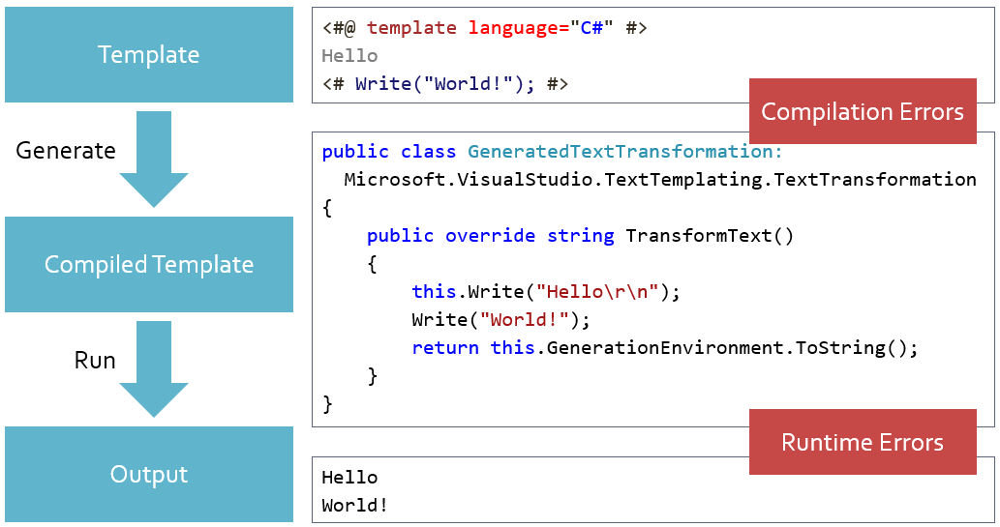

# Troubleshooting Code Generation Errors

There are two distinct stages in the process of generating output from a template, which is also known as template transformation.



During the first stage, the T4 engine parses the template, uses its text blocks, code blocks and directives 
to create a special class called `GeneratedTextTransformation` and compiles it in a temporary .NET assembly. Errors that 
may occur during this stage include those detected by the engine in the template syntax and those detected by the compiler 
when compiling the `GeneratedTextTransformation`.

During the second stage, the engine creates an instance of the `GeneratedTextTransformation` class, calls its `TransformText` 
method and saves the string it returns to the output file. Errors that occur during this stage are exceptions thrown by code 
in the `GeneratedTextTransformation` when it is running.

## Troubleshooting Compilation Errors

Open the `Products_Delete.tt` template (created in the [previous](./creating-simple-code-generation-script.html) part of this 
tutorial) in Visual Studio. As you may recall, it’s a code generation script that produces a `DELETE` stored procedure using 
table schema information retrieved from SQL server using SMO.

- Simulate a parsing error by misspelling one of the `assembly` directives as `assembl`. 

```
<#@ assembl name="System.Xml" #>
``` 

- Save the template file or select the _Run Custom Tool_ item from context menu in the Solution Explorer to trigger template 
transformation.


The T4 engine reports errors in the Error List window of Visual Studio. Compilation errors, like this one, include information 
about the file and the line where it occurred. You can double-click the error in the Error List to quickly jump to the location 
where it occurred in the template source code.

- Correct spelling of the `assembly` directive, save the template file and verify that the compilation error disappears from the list.

## Troubleshooting Runtime Errors

- Simulate a runtime error by assigning `null` to the `server` variable. This should trigger a run-time exception in the call to Database constructor.

```
<#
    Server server = null; 
    var database = new Database(server, "Northwind");
    var table = new Table(database, "Products");
    table.Refresh();
#>
```

- Save the template file or select the _Run Custom Tool_ item from context menu in the Solution Explorer to trigger template 
transformation.


Runtime errors are reported as exceptions converted to string. Note that the Line number for this error doesn’t point to the 
actual location of this error. Although the File column shows correct file name in this case, it will not be correct for runtime 
errors that occur in a template file referenced from another file with the `include` directive.

Only the first line of the exception string is reported by default. You can see additional details, including stack trace of 
the exception in the tooltip window. You can also see it in the _Error List_ window itself by clicking the arrow in the 
_Show Details_ column. 

```
Running transformation: Microsoft.SqlServer.Management.Smo.FailedOperationException: SetParent failed for Database 'Northwind'.  
---> System.ArgumentNullException: Value cannot be null. Parameter name: newParent
   at Microsoft.SqlServer.Management.Smo.SqlSmoObject.SetParentImpl(SqlSmoObject newParent)
   --- End of inner exception stack trace ---
   at Microsoft.SqlServer.Management.Smo.SqlSmoObject.SetParentImpl(SqlSmoObject newParent)
   at Microsoft.SqlServer.Management.Smo.Database..ctor(Server server, String name)
   at Microsoft.VisualStudio.TextTemplating1805C519B2FAC658A6E510DC975FFA981A1ED7152FBCE.GeneratedTextTransformation.TransformText()	
```

By default, only method names are included in the stack trace. You can enable additional diagnostics by transforming 
the template in _debug_ mode.

```
<#@ template language="C#" debug="true" #>
```

- Set `debug` parameter of the `template` directive to `true`.
- Save the template file or select the _Run Custom Tool_ item from context menu in the Solution Explorer to trigger template
transformation.

```
Running transformation: Microsoft.SqlServer.Management.Smo.FailedOperationException: SetParent failed for Database 'Northwind'.  
---> System.ArgumentNullException: Value cannot be null. Parameter name: newParent
   at Microsoft.SqlServer.Management.Smo.SqlSmoObject.SetParentImpl(SqlSmoObject newParent)
   --- End of inner exception stack trace ---
   at Microsoft.SqlServer.Management.Smo.SqlSmoObject.SetParentImpl(SqlSmoObject newParent)
   at Microsoft.SqlServer.Management.Smo.Database..ctor(Server server, String name)
   at Microsoft.VisualStudio.TextTemplating1805C519B2FAC650C07B7524AFFA981A1ED7152FBCE.GeneratedTextTransformation.TransformText() 
   in c:\Git\olegsych\T4Toolbox\ClassLibrary1\ClassLibrary1\delete_procedure.tt:line 10
```

Note that the exception stack trace now includes the file name and the line number pointing to the exact location where the error
has occurred. This will help you to find and fix simpler runtime errors. In more difficult cases, when the cause of the error is 
not as obvious, you may need to debug the template by selecting the _Debug T4 Template_ item from the context menu in Solution Explorer.

## Troubleshooting Obscure Compilation Errors

Transforming the template in debug mode can also help troubleshoot some of the obscure template compilation errors, because 
the T4 engine saves the source code of `GeneratedTextTransformation` to a temporary file which you can take a look at.

- Open the most recently modified .cs file from the `%TEMP%` directory on your computer. 